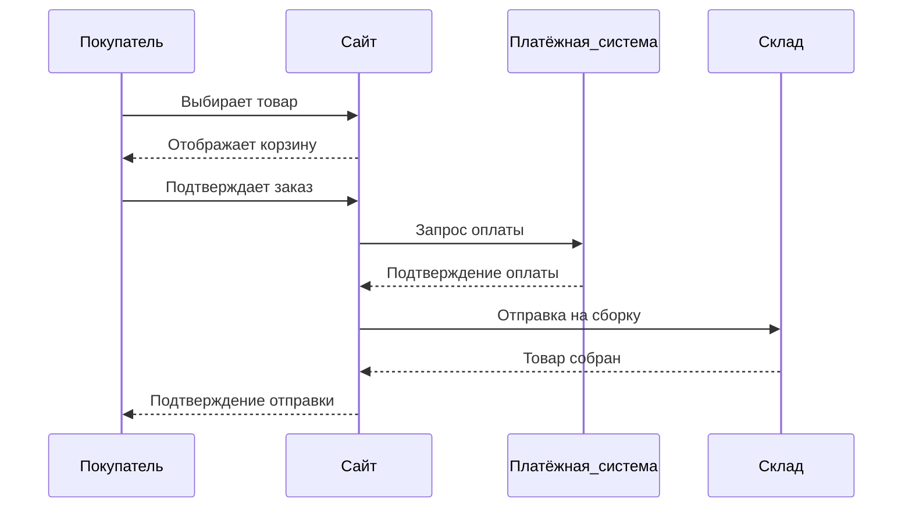

# Лабораторная работа по Markdown

**Студент:** Иванов Иван Иванович  
**Группа:** ИТ-202  
**Дата выполнения:** 26 октября 2025 г.

---

## Содержание

- [Введение](#введение)
- [Основная часть](#основная-часть)
  - [Математические формулы](#математические-формулы)
  - [Диаграммы с Mermaid](#диаграммы-с-mermaid)
  - [Встроенный HTML: аудиоплеер](#встроенный-html-аудиоплеер)
  - [Сложные таблицы](#сложные-таблицы)
  - [Галерея изображений](#галерея-изображений)
  - [Вложенные списки](#вложенные-списки)
  - [Подсветка синтаксиса](#подсветка-синтаксиса)
  - [Цитаты](#цитаты)
- [Заключение](#заключение)

---

## Введение

Цель данной лабораторной работы — освоить возможности языка разметки Markdown для создания структурированных, информативных и визуально привлекательных документов. В ходе выполнения задания были использованы различные элементы Markdown, включая заголовки, списки, таблицы, изображения, ссылки, цитаты, блоки кода, а также расширенные функции, такие как математические формулы, диаграммы Mermaid, HTML-вставка и другие.

---

## Основная часть

### Математические формулы

Для вычисления гипотенузы прямоугольного треугольника используется теорема Пифагора:

$$
c = \sqrt{a^2 + b^2}
$$

где:
- $a$ и $b$ — длины катетов,
- $c$ — длина гипотенузы.

### Диаграммы с Mermaid

Ниже представлена диаграмма последовательности, иллюстрирующая процесс покупки товара в интернет-магазине:



### Встроенный HTML: аудиоплеер

<audio controls>
<source src="https://www.soundjay.com/buttons/sounds/button-09.mp3" type="audio/mpeg">
Ваш браузер не поддерживает элемент audio.
</audio>


### Сложные таблицы

Таблица с выравниванием текста для списка книг:

| Название книги                     | Автор                | Год издания | Жанр        |
|:----------------------------------|:--------------------:|------------:|-------------|
| *1984*                            | Джордж Оруэлл       |        1949 | Антиутопия  |
| *Мастер и Маргарита*              | Михаил Булгаков     |        1967 | Фантастика  |
| *Гарри Поттер и философский камень* | Дж. К. Роулинг       |        1997 | Фэнтези     |

> Текст выровнен: слева, по центру, справа и по умолчанию.

### Галерея изображений

Ниже представлена галерея из трёх изображений автомобилей:

  
*Рис. 1: Арбузы*

  
*Рис. 2: Krutaya mashina*

  
*Рис. 3: plohaya whednaya eda*


### Вложенные списки

План поездки на выходные:

- **Пятница**
  - поехать на пары
- **Суббота**
  - поехать отдыхать от пар
- **Воскресенье**
  - поехать делать чето для пар

### Подсветка синтаксиса

Пример кода на **C**:

```C
#include <stdio.h>

int main(void){
        float a, b;

        printf("Введите значение a: ");
        scanf("%f", &a);
        printf("\n");
        printf("Введите значение b: ");
        scanf("%f", &b);

        return 0;
}
```

Пример кода на **Python**:

```python
def main():
  a = 52 + 42
  print($"НУ ЧЕТО ЕСТЬ #{a}")
```

### Цитаты

> «Пары не удары - можно и пропустить».  
> — **Дж. Стетхем**

---

## Заключение

В ходе выполнения лабораторной работы были успешно применены различные возможности языка Markdown, включая как базовые элементы (заголовки, списки, таблицы), так и расширенные функции (математические формулы, Mermaid-диаграммы, HTML-вставка и др.). 

:blush: Все требования задания выполнены.  

:warning: Смайлики вроде тоже использются ( сейчас )

:thumbsdown: Исходный код в https://github.com/Xjensu/LichIPPR

---
